<picture>
  <source media="(prefers-color-scheme: dark)" srcset="assets/boot-dark.svg">
  <source media="(prefers-color-scheme: light)" srcset="assets/boot-light.svg">
  
</picture>

<picture>
  <source media="(prefers-color-scheme: dark)" srcset="assets/sysinfo-dark.svg">
  <source media="(prefers-color-scheme: light)" srcset="assets/sysinfo-light.svg">
  
</picture>

## <samp>$ ls ~/ships</samp>

  <a href="https://github.com/KiwiGaze/glm-for-copilot"><picture>
    <source media="(prefers-color-scheme: dark)" srcset="assets/card-glm-for-copilot-dark.svg">
    <source media="(prefers-color-scheme: light)" srcset="assets/card-glm-for-copilot-light.svg">
    
  </picture></a>
  <a href="https://github.com/multica-ai/multica"><picture>
    <source media="(prefers-color-scheme: dark)" srcset="assets/card-multica-dark.svg">
    <source media="(prefers-color-scheme: light)" srcset="assets/card-multica-light.svg">
    
  </picture></a>

  <a href="https://github.com/KiwiGaze/velata"><picture>
    <source media="(prefers-color-scheme: dark)" srcset="assets/card-velata-dark.svg">
    <source media="(prefers-color-scheme: light)" srcset="assets/card-velata-light.svg">
    
  </picture></a>
  <a href="https://github.com/KiwiGaze/arXiv-chat"><picture>
    <source media="(prefers-color-scheme: dark)" srcset="assets/card-arxiv-chat-dark.svg">
    <source media="(prefers-color-scheme: light)" srcset="assets/card-arxiv-chat-light.svg">
    
  </picture></a>

  <a href="https://github.com/KiwiGaze/codex-status-bar"><picture>
    <source media="(prefers-color-scheme: dark)" srcset="assets/card-codex-status-bar-dark.svg">
    <source media="(prefers-color-scheme: light)" srcset="assets/card-codex-status-bar-light.svg">
    
  </picture></a>
  <a href="https://github.com/KiwiGaze/OmniSearches"><picture>
    <source media="(prefers-color-scheme: dark)" srcset="assets/card-omnisearches-dark.svg">
    <source media="(prefers-color-scheme: light)" srcset="assets/card-omnisearches-light.svg">
    
  </picture></a>

archive: [FlowAgenda](https://github.com/KiwiGaze/FlowAgenda) · [personal-portfolio-site](https://github.com/KiwiGaze/personal-portfolio-site) · [simplifying](https://github.com/KiwiGaze/simplifying)

## <samp>$ git log upstream/multica --author=kiwigaze</samp>

> [multica-ai/multica](https://github.com/multica-ai/multica) — the open-source managed agents platform · 41k+ ★

- [`#3159`](https://github.com/multica-ai/multica/pull/3159) `merged` — `/` slash-command palette for invoking agent skills — React/TipTap UI + Go daemon prompt handling
- [`#3210`](https://github.com/multica-ai/multica/pull/3210) `merged` — fix duplicate desktop back-navigation in the Electron platform layer
- [`#2973`](https://github.com/multica-ai/multica/pull/2973) `merged` — mobile readability for skill browsing + file-viewer pages
- [`#2670`](https://github.com/multica-ai/multica/pull/2670) `merged` — transparent avatar rendering fix
- [`#2915`](https://github.com/multica-ai/multica/pull/2915) `open` — precheckout task repositories before daemon agent startup

## <samp>$ stack --list</samp>

<picture>
  <source media="(prefers-color-scheme: dark)" srcset="assets/skills-dark.svg">
  <source media="(prefers-color-scheme: light)" srcset="assets/skills-light.svg">
  
</picture>

## <samp>$ tail -f /var/log/telemetry</samp>

<picture>
  <source media="(prefers-color-scheme: dark)" srcset="https://github-readme-activity-graph.vercel.app/graph?username=KiwiGaze&bg_color=0b0f0d&color=cfe3d8&line=00e69a&point=f5b957&area=true&area_color=00e69a&hide_border=true&radius=8">
  <source media="(prefers-color-scheme: light)" srcset="https://github-readme-activity-graph.vercel.app/graph?username=KiwiGaze&bg_color=f7f5ee&color=26382e&line=0a7d4f&point=a86d0a&area=true&area_color=0a7d4f&hide_border=true&radius=8">
  
</picture>

<picture>
  <source media="(prefers-color-scheme: dark)" srcset="https://raw.githubusercontent.com/KiwiGaze/KiwiGaze/output/github-contribution-grid-snake-dark.svg">
  <source media="(prefers-color-scheme: light)" srcset="https://raw.githubusercontent.com/KiwiGaze/KiwiGaze/output/github-contribution-grid-snake.svg">
  
</picture>

<samp>$ echo "simplifying the world, one tool at a time."</samp>

